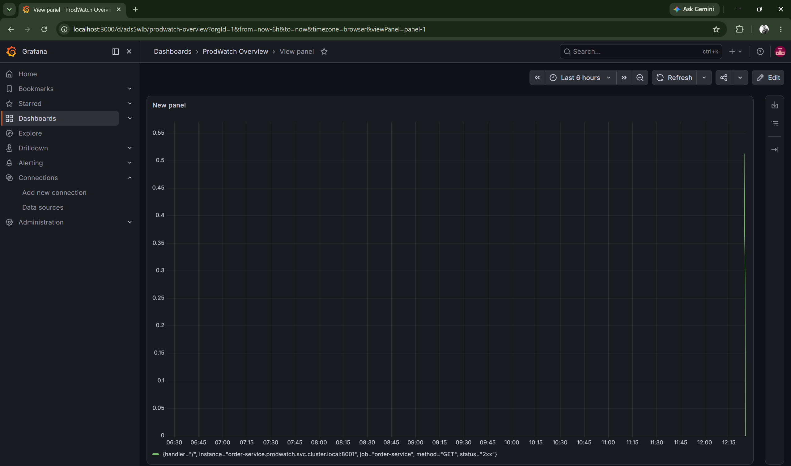
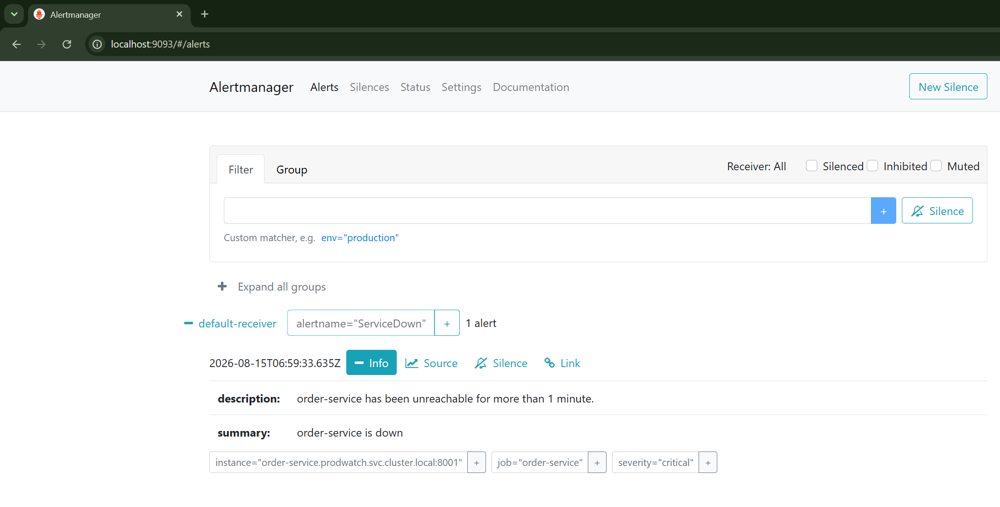
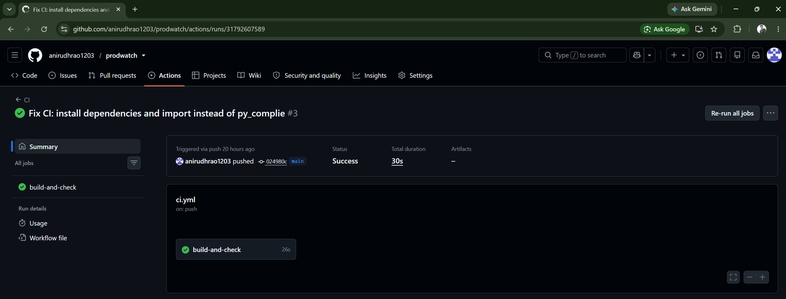

# prodwatch

A production-style microservices application built to learn and demonstrate core DevOps/Cloud/SRE skills: containerization, Kubernetes orchestration, Infrastructure as Code, observability, and CI automation.

ProdWatch simulates a small e-commerce backend - an Order Service and an Inventory Service that communicate over HTTP - deployed on Kubernetes, provisioned with Terraform, and monitored with a full Prometheus/Grafana/AlertManager stack.

## Why this project

Built as a hands-on path toward a Cloud Support / SRE role, this project deliberately covers the full lifecycle a real production system goes through: writing the application, containerizing it, orchestrating it, defining its infrastructure as code, observing its health, and validating changes automatically.

## Architecture

```
GitHub (source + CI)
        |
        v
   GitHub Actions ---- validates code + Docker builds on every push
        |
        v
  (deployed manually via Terraform, documented as the CD next step)
        |
        v
+-----------------------------------------------------+
|              Minikube Kubernetes cluster             |
|                 (namespace: prodwatch)               |
|                                                      |
|  +----------------+        +--------------------+    |
|  | Order Service  | -----> | Inventory Service  |    |
|  |  (FastAPI)     |        |    (FastAPI)       |    |
|  |  NodePort      |        |    ClusterIP       |    |
|  +----------------+        +--------------------+    |
|         |    /metrics             |    /metrics      |
|         v                         v                  |
|              +-------------------+                   |
|              |    Prometheus     |  <-- scrapes both |
|              +-------------------+      services     |
|                 |            |                       |
|                 v            v                       |
|          +-----------+  +--------------+             |
|          |  Grafana  |  | AlertManager |             |
|          +-----------+  +--------------+             |
|                                                      |
+-----------------------------------------------------+

All infrastructure above is defined in Terraform (Kubernetes provider).
Prometheus + Grafana persist data via PersistentVolumeClaims.
```

## Tech stack

| Layer 		 | Tools 				|

| Application 		 | Python, FastAPI, httpx, Pydantic 	|
| Containerization 	 | Docker, Docker Compose 		|
| Orchestration 	 | Kubernetes (minikube, Docker driver) |
| Infrastructure as Code | Terraform (Kubernetes provider) 	|
| Observability 	 | Prometheus, Grafana, AlertManager 	|
| CI/CD 		 | GitHub Actions 			|
| Dev environment 	 | Windows + WSL2 (Ubuntu) 		|

## What each service does

- **Inventory Service** - tracks stock levels for a small set of products, exposes endpoints to check and reserve stock
- **Order Service** - accepts orders, calls Inventory Service over HTTP to reserve stock before confirming an order

Both expose:
- `/health` - liveness/readiness endpoint, checked by Kubernetes probes
- `/metrics` - Prometheus-format metrics (request counts, latency histograms), via `prometheus-fastapi-instrumentator`

## Project phases

**Phase 1 — Environment & Docker fundamentals**
Set up WSL2 + Ubuntu + Docker Desktop, built and ran a first containerized script, pushed an image to Docker Hub.

**Phase 2 — Microservices with FastAPI**
Built Inventory Service and Order Service, connected them over HTTP, ran both together with Docker Compose using service-name-based networking.

**Phase 3 — Kubernetes**
Deployed both services on a local minikube cluster as Deployments + Services, added liveness/readiness probes, CPU/memory resource limits, and a ConfigMap for externalized configuration. Verified internal (ClusterIP) vs external (NodePort) service access.

**Phase 4 — Infrastructure as Code with Terraform**
Rewrote the entire Kubernetes setup (namespace, Deployments, Services, ConfigMap) as Terraform resources. Practiced the full `plan` → `apply` → `destroy` → `apply` lifecycle to prove infrastructure is fully reproducible from code.

**Phase 5 — Observability**
Deployed Prometheus (metrics collection), Grafana (dashboards), and AlertManager (alerting) on the cluster. Instrumented both services with real metrics, built a live request-rate dashboard, wrote and tested a `ServiceDown` alert rule through its full lifecycle (Inactive → Pending → Firing), and added PersistentVolumeClaims after diagnosing real data loss on Pod restart.

**Phase 6 — CI/CD & documentation**
Built a GitHub Actions CI pipeline that installs dependencies, verifies both services import cleanly, and confirms Docker images build successfully on every push. Documented the project for portfolio use.

## Running it locally

Prerequisites: WSL2 + Ubuntu, Docker Desktop, minikube, kubectl, Terraform.

```bash
# Clone the repo
git clone https://github.com/anirudhrao1203/prodwatch.git
cd prodwatch

# Start the cluster
minikube start --driver=docker
eval $(minikube docker-env)

# Build images into minikube's Docker
docker build -t inventory-service:v1 ./inventory-service
docker build -t order-service:v1 ./order-service

# Deploy infrastructure with Terraform
cd terraform
terraform init
terraform apply

# Deploy the monitoring stack
cd ../monitoring
kubectl apply -f storage.yml
kubectl create configmap prometheus-config -n prodwatch \
  --from-file=prometheus.yml=prometheus-config.yml \
  --from-file=alert-rules.yml=alert-rules.yml
kubectl apply -f prometheus.yml
kubectl create configmap alertmanager-config --from-file=alertmanager.yml=alertmanager-config.yml -n prodwatch
kubectl apply -f alertmanager.yml
kubectl apply -f grafana.yml

# Verify everything is running
kubectl get pods -n prodwatch
```

Access the services:
```bash
kubectl port-forward service/order-service 8001:8001 -n prodwatch
kubectl port-forward service/grafana 3000:3000 -n prodwatch
kubectl port-forward service/prometheus 9090:9090 -n prodwatch
kubectl port-forward service/alertmanager 9093:9093 -n prodwatch
```

## Screenshots

**Grafana dashboard - live request rate**


**AlertManager - ServiceDown alert firing**


**GitHub Actions - CI passing**


## What I'd add next

- **Remote Terraform state (S3 + DynamoDB locking)** -  deferred for this solo project since it requires an AWS account; understood and documented the concept and when it becomes necessary for a team
- **Real database** - replace the in-memory dictionaries with a proper database (e.g. AWS RDS/PostgreSQL), including Kubernetes Secrets for credentials
- **Full CD to a cloud-hosted cluster** - extend GitHub Actions to deploy against a real cloud Kubernetes cluster (EKS/GKE), which a local minikube cluster can't support since it isn't reachable from GitHub's servers
- **Kubernetes auto-discovery for Prometheus** - replace static scrape targets with label-based service discovery

## Key debugging experience gained

Beyond the "happy path," this project involved substantial real troubleshooting: Docker Desktop/WSL2 integration failures, YAML indentation and case-sensitivity bugs, Kubernetes storage lock conflicts during rolling updates (fixed with `strategy: Recreate`), PersistentVolume-driven data loss diagnosis, GitHub PAT scope issues, and CI environment differences between local and hosted runners.

